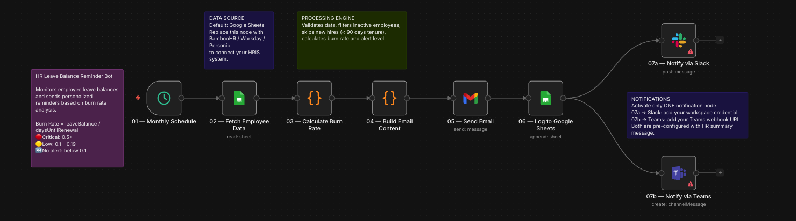
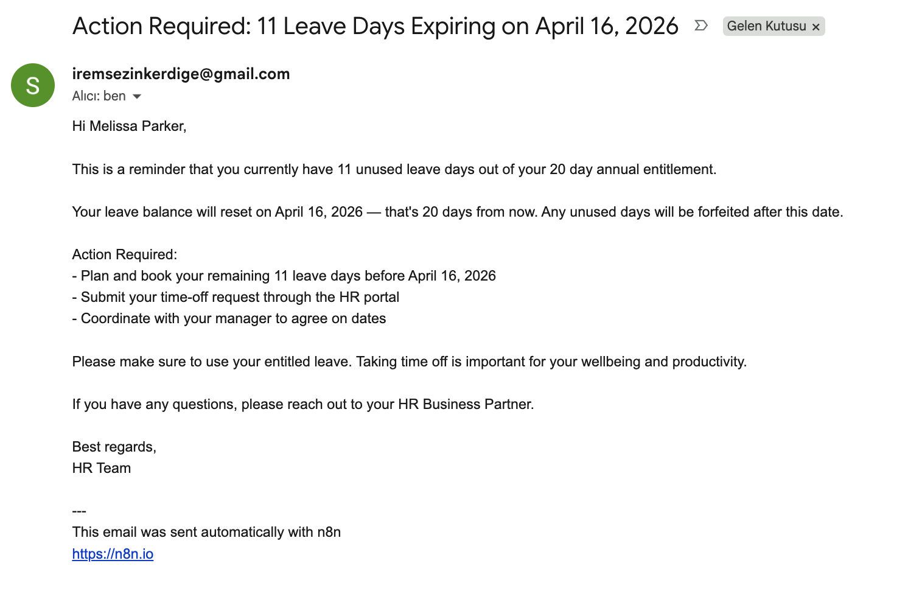

# HR Leave Balance Reminder Bot


> **Automatically monitor employee leave balances, calculate burn rates, and send personalised reminders before entitlements expire — keeping employees informed and HR teams ahead of unused-leave liability.**

---

## Workflow Preview



---

## What It Does

- Runs automatically on a **monthly schedule** (first of every month, 9 PM server time)
- Reads employee leave data from **Google Sheets** — or any connected HRIS (BambooHR, Workday, Personio, Hibob)
- Calculates each employee's **burn rate** — how fast they need to consume remaining leave before renewal
- Filters out inactive employees, new hires (< 90 days), and bad data automatically
- Sends **personalised email reminders** at three urgency tiers: Critical, Warning, and Low
- Logs every notification run to a **Google Sheets audit log** for compliance and reporting
- Posts a **summary digest** to Slack or Microsoft Teams after each run

---

## Sample Email



---

## How Burn Rate Logic Works

Burn rate answers one simple question: *"How many leave days does this employee need to take per day to use up their balance before it expires?"*

```
Burn Rate = leaveBalance / daysUntilRenewal
```

### Alert Thresholds

| Alert Level | Burn Rate | Meaning | Action |
|-------------|-----------|---------|--------|
| 🔴 **Critical** | ≥ 0.5 | Must take more than 1 day every 2 days | Immediate action required |
| 🟠 **Warning** | 0.2 – 0.49 | Balance running down fast | Start planning now |
| 🟡 **Low** | 0.1 – 0.19 | Mild risk building up | Friendly nudge sent |
| ⏭️ **No alert** | < 0.1 | Balance is healthy | No notification sent |

**Renewal date** is calculated per employee from their hire-date anniversary. Employees who have already passed their anniversary this calendar year are projected forward to the next year automatically.

All threshold values are editable directly in the Node 03 code block — no separate config files needed.

---

## Prerequisites

- **n8n** self-hosted v1.x+ or n8n Cloud
- A **Google account** with Google Sheets access (OAuth2 credential configured in n8n)
- A **Gmail account** (OAuth2 credential configured in n8n) — or swap to Outlook / SMTP
- *(Optional)* Slack workspace token or Microsoft Teams webhook for summary digests

---

## Quick Start — Google Sheets

### 1. Prepare Your Spreadsheet

Create a Google Sheet with two tabs:

**Tab 1 — `hr_mock_data`** (employee data)

| Column | Type | Example |
|--------|------|---------|
| `id` | string | `EMP001` |
| `name` | string | `Jane Smith` |
| `email` | string | `jane@company.com` |
| `department` | string | `Engineering` |
| `hireDate` | ISO date | `2021-06-15` |
| `leaveBalance` | integer | `12` |
| `leaveTotal` | integer | `25` |
| `status` | string | `active` |

**Tab 2 — `Log`** (auto-populated by the bot after each run)

| Column | Description |
|--------|-------------|
| `timestamp` | ISO timestamp of the run |
| `employeeID` | Employee ID |
| `employeeName` | Full name |
| `department` | Department |
| `leaveBalance` | Remaining days at time of alert |
| `renewalDate` | Next renewal date |
| `daysUntilRenewal` | Days remaining until renewal |
| `burnRate` | Calculated burn rate |
| `alertLevel` | `critical` / `warning` / `low` |
| `emailSubject` | Subject line sent |

### 2. Import the Workflow

1. In n8n, go to **Workflows → Import from file**
2. Upload `hr-leave-balance-bot.json`

### 3. Connect Credentials

| Node | Credential needed |
|------|------------------|
| 02 — Fetch Employee Data | Google Sheets OAuth2 |
| 05 — Send Email | Gmail OAuth2 |
| 06 — Log to Google Sheets | Google Sheets OAuth2 |
| 07a — Notify via Slack *(optional)* | Slack OAuth2 (Bot Token) |
| 07b — Notify via Teams *(optional)* | Microsoft Teams webhook |

### 4. Point to Your Spreadsheet

Open nodes **02** and **06**, click the **Document** selector, and choose your spreadsheet and the correct sheet tab.

### 5. Activate

Toggle the workflow to **Active**. It will fire automatically on the first day of every month at 9 PM server time.

---

## HRIS Integrations

The workflow ships with Google Sheets as the default data source. Only **Node 02 — Fetch Employee Data** needs to be swapped to connect a different system.

> **Tip:** After swapping the data source, ensure field names entering Node 03 match: `id`, `name`, `email`, `department`, `hireDate`, `leaveBalance`, `leaveTotal`, `status`. Use an n8n **Set** node immediately after your data source to rename fields if needed.

### Google Sheets (default)
Uses `n8n-nodes-base.googleSheets`. Set up OAuth2 credentials in n8n and point the node at your spreadsheet.

### BambooHR
Replace Node 02 with an **HTTP Request** node:
```
GET https://api.bamboohr.com/api/gateway.php/{subdomain}/v1/employees/directory
Authorization: Basic base64(apiKey:x)
Accept: application/json
```
Map: `id`, `displayName`, `workEmail`, `department`, `hireDate`.
Fetch leave balances with a second HTTP Request to `/v1/employees/{id}/time_off/calculator`.

### Workday
Replace Node 02 with an **HTTP Request** node:
```
GET https://{tenant}.workday.com/api/v1/workers?format=json
Authorization: Bearer {token}
```
Use the Workday `timeOffBalance` object to populate `leaveBalance` and `leaveTotal`.

### Personio
Replace Node 02 with an **HTTP Request** node:
```
GET https://api.personio.de/v1/company/employees
Authorization: Bearer {token}
```
Map `id`, `first_name + last_name`, `email`, `department`, `hire_date`, and time-off balance fields from the response.

### Hibob
Replace Node 02 with an **HTTP Request** node:
```
GET https://api.hibob.com/v1/people
Authorization: Basic {serviceUserToken}
```
Map `id`, `displayName`, `email`, `work.department`, `work.startDate`, and balance fields from `timeOff.policy.balance`.

---

## Node Structure

```
01 — Monthly Schedule
        │
        ▼
02 — Fetch Employee Data          ← swap for BambooHR / Workday / Personio / Hibob
        │
        ▼
03 — Calculate Burn Rate          ← filters, calculates burnRate, assigns alertLevel
        │
        ▼
04 — Build Email Content          ← generates personalised subject + body per level
        │
        ▼
05 — Send Email                   ← Gmail (swap for Outlook / SMTP)
        │
        ▼
06 — Log to Google Sheets         ← appends one row per notification to audit log
        │
       ┌┴─────────────────┐
       ▼                   ▼
07a — Notify via Slack   07b — Notify via Teams
```

### Node Reference Table

| Node | Type | Purpose |
|------|------|---------|
| 01 — Monthly Schedule | Schedule Trigger | Fires on the 1st of each month at 21:00 |
| 02 — Fetch Employee Data | Google Sheets | Reads all rows from `hr_mock_data` tab |
| 03 — Calculate Burn Rate | Code (JS) | Filters, computes burnRate, assigns alertLevel |
| 04 — Build Email Content | Code (JS) | Generates personalised subject + body |
| 05 — Send Email | Gmail | Sends individual email to each employee |
| 06 — Log to Google Sheets | Google Sheets | Appends audit row per notification |
| 07a — Notify via Slack | Slack | Posts run summary to `#hr-alerts` |
| 07b — Notify via Teams | Microsoft Teams | Posts run summary to configured channel |

---

## Output Integrations

### Gmail (default)
Node **05 — Send Email** uses `n8n-nodes-base.gmail` with OAuth2. Each email is sent individually with a personalised body tailored to the employee's alert level.

### Outlook / Microsoft 365
Swap Node 05 for `n8n-nodes-base.microsoftOutlook`. The same `$json.email`, `$json.emailSubject`, and `$json.emailBody` expressions work without changes.

### SMTP (any provider)
Swap Node 05 for `n8n-nodes-base.emailSend`. Configure host, port, and credentials in the node settings.

### Slack (summary digest)
Node **07a — Notify via Slack** posts a run summary to `#hr-alerts` after all emails are sent. Requires a Bot Token credential with `chat:write` scope and the bot invited to the channel.

### Microsoft Teams (summary digest)
Node **07b — Notify via Teams** posts the same summary digest. Configure your team and channel ID via the list selectors in the node UI.

> **Note:** Nodes 07a and 07b run in parallel after the logging step. Activate one, both, or neither depending on your notification stack.

---

## Configuration Reference

All configuration lives directly inside n8n — no environment variables or config files required.

| Setting | Where to change | Default |
|---------|----------------|---------|
| Schedule frequency | Node 01 → Rule → Interval | Monthly at 9 PM |
| Data source spreadsheet | Node 02 → Document selector | Demo spreadsheet |
| Data source sheet tab | Node 02 → Sheet Name selector | `hr_mock_data` |
| Email sender credential | Node 05 → Credentials | Gmail OAuth2 |
| Log spreadsheet | Node 06 → Document selector | Demo spreadsheet |
| Log sheet tab | Node 06 → Sheet Name selector | `Log` |
| Slack channel | Node 07a → Channel | `#hr-alerts` |
| Teams team + channel | Node 07b → Team / Channel | *(empty — fill in)* |
| Critical threshold | Node 03 → JS code → `burnRate >= 0.5` | `0.5` |
| Warning threshold | Node 03 → JS code → `burnRate >= 0.2` | `0.2` |
| Low threshold | Node 03 → JS code → `burnRate >= 0.1` | `0.1` |
| Minimum tenure (days) | Node 03 → JS code → `tenureDays < 90` | `90` |

---

## Edge Cases Handled

The burn rate engine applies the following data-quality guards. Employees that fail any check are **silently skipped** — they will not receive an email and will not appear in the audit log.

| Condition | Why it's skipped |
|-----------|-----------------|
| `status !== 'active'` | Inactive / terminated employees should not receive reminders |
| `leaveBalance` or `leaveTotal` is NaN | Non-numeric data in the sheet — fix the cell value |
| `leaveTotal <= 0` | Zero or negative entitlement is invalid |
| `leaveBalance <= 0` | Nothing left to remind about |
| `leaveBalance > leaveTotal` | Data integrity violation — balance exceeds entitlement |
| `hireDate` is not a valid date | Cannot calculate tenure or renewal date |
| Tenure < 90 days | New hires are excluded — too early in their leave cycle |
| `burnRate < 0.1` | Balance is healthy — no notification needed |

---

## Troubleshooting

**No emails sent — workflow runs but produces no output**
- Check that the Google Sheet tab name matches exactly (case-sensitive: `hr_mock_data`)
- Verify the sheet has a header row and at least one row with `status = active`
- Confirm `hireDate` uses ISO format: `YYYY-MM-DD`
- Make sure no employees have tenure < 90 days (all would be filtered out)
- Confirm at least one employee has a burn rate ≥ 0.1

**`leaveBalance` or `leaveTotal` shows as NaN**
- Ensure columns contain plain integers, not text with units (`12 days` fails — use `12`)

**Gmail credential error**
- Re-authorise the Gmail OAuth2 credential in n8n **Settings → Credentials**
- Verify the Google Cloud project has the Gmail API enabled

**Google Sheets 403 error**
- Re-authorise the Google Sheets OAuth2 credential
- Confirm the OAuth user or service account has edit access to the spreadsheet

**Slack message not sent**
- Node 07a requires a Bot Token with `chat:write` scope
- Confirm the bot has been invited to the target channel: `/invite @your-bot-name`

**Teams message not sent**
- Select your team and channel using the list dropdowns in Node 07b — do not type IDs manually; they must be resolved via the n8n UI

**Burn rate thresholds feel off for your policy**
- Adjust the three `if (burnRate >= ...)` conditions in the Node 03 code block directly

---

## Changelog

### v2.0.0
- Added Microsoft Teams summary digest node (07b) running in parallel with Slack
- Introduced `usedPercentage` field for richer email body context
- Burn rate now rounded to 2 decimal places in the audit log
- Email subject lines differentiated per alert tier with distinct prefixes
- Data guard added for `leaveBalance > leaveTotal` integrity check
- Sticky-note annotations added to all major workflow sections

### v1.0.0
- Initial release
- Google Sheets data source with OAuth2
- Three-tier burn rate alert engine (critical / warning / low)
- Personalised Gmail notifications per employee
- Audit log appended to Google Sheets after each run
- Slack summary digest node

